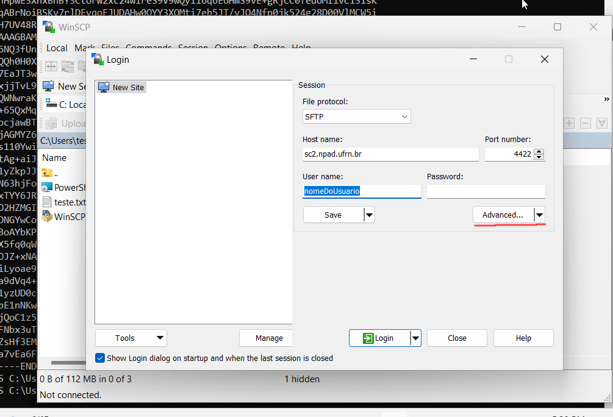

# Copiando Arquivos através de uma Interface gráfica WinSCP (Windows)

Ao contrário do linux, o windows explorer não possui suporte ao **scp**, tendo
que fazer uso de um programa de terceiros chamado **WinSCP**. Para instalar o
WinSCP vá no [site oficial](https://winscp.net/eng/download.php) e clique em **Download**. Após a finalização do download, clique no executável e instale a aplicação. Ao executar a aplicação irá aparecer a seguinte interface:

      

- *HostName* coloque: **sc2.npad.ufrn.br**

- *Port number* coloque **4422**  

- *User name* coloque o seu nome de usuário

- IMPORTANTE: deixe o campo *Password* vazio

Depois clique em **Advanced...**

Em Advanced, vá em **Authentication**, um submenu de **SSH**. Procure por **Private
key file** e clique nos três pontinhos (**...**). Agora você precisa procurar a
chave **privada** que foi criada anteriormente, no meu caso o nome dela é **id_rsa**.

## PuTTy

Caso você esteja utilizando o **Putty** vá onde você salvou a chave privada pelo **PuttyGen**.

## OpenSSH + Windows PowerShell

Caso você tenha esteja usando OpenSSH e Windows PowerShell e não tenha mudado o nome da chave, o caminho até a chave privada é **C:\Users\NomeDoSeuUsuário\\.ssh\id_rsa**. Para visualiza-lá terá que selecionar a opção: **todos os tipos de arquivo**.

## MobaXterm

No caso em que você esteja usando o MobaXterm, saiba que o local padrão em que
o MobaXterm salva as chaves é **C:\Users\NomeDoSeuUsuário\AppData\Roaming\MobaXterm\home\\.ssh**.  Para visualizar a chave terá que selecionar a opção: **todos os tipos de arquivo**.

Se tudo der certo o WinSCP irá pedir para converter a Chave em formato *OpenSSH* para um formado *PuTTY* caso precise. Concorde, converta, salve e saída das configurações avançadas através do botão **OK**. Quando você pressionar o botão **Login**. Você terá acesso ao seu sistema de arquivos do supercomputador. O WinSCP irá parecer como uma dessas duas telas dependendo do layout escolhido durante a instalação.

## Informações extras sobre a aplicação utilizada

- **WinSCP**: [winscp docs](https://winscp.net/eng/docs/start)
